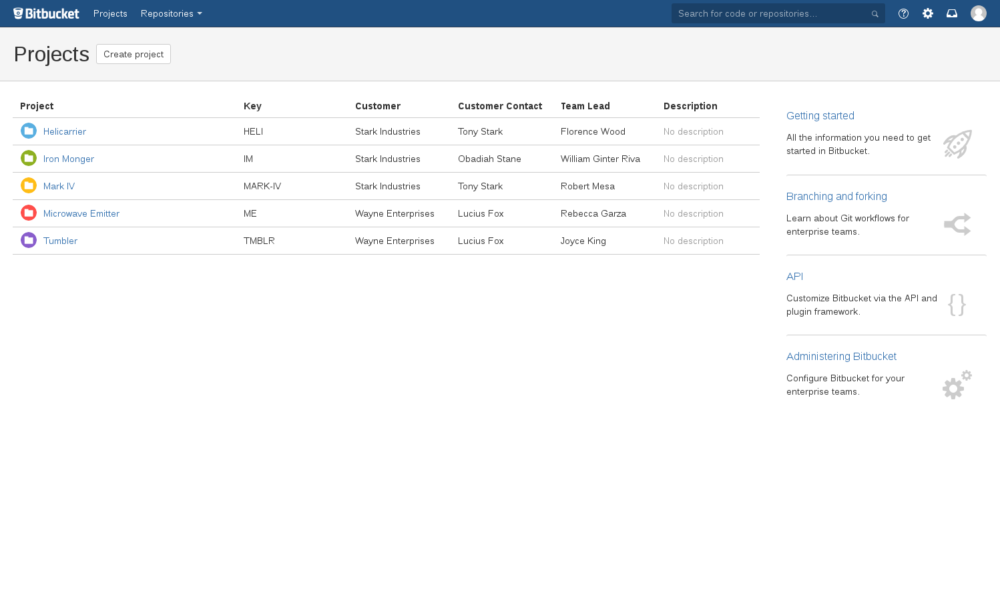

# Project Fields

The **Project Fields** plugin gives you the ability to attach new fields to Bitbucket projects which can hold arbitrary information. These fields can optionally be shown as additional columns in the project list.

## Global settings

System administrators can add, edit, and delete fields site-wide. To do so, open the Bitbucket Administration page and click the "Custom project fields" link under the Add-ons section.

To create a new field, click the plus button on the bottom-right corner of the table. Edit existing fields by interacting with the field's row, and delete existing fields by clicking the X button on the right edge of the field's row. Note that all changes, including row addition/removal, are not applied until you click Save.

A field's settings are as follows:

* **Name**: The name of the field, displayed on the project list and each project's settings page.
* **Description**: More information about the field.
* **Options**: Possible values for the field, one per line. If left blank, the field is free-form and allows any value.
* **Visible**: If set, the field is shown on the project list. If not, the field's value is only visible in the project's settings.
* **Editable**: If set, project admins can set the field's value. If not, only system admins can update it.

## Project settings

Project administrators can view and potentially edit field values. To do so, open the project's settings page and click the "Custom fields" link.

All fields configured on the site will be listed, along with their description and the current project's value. The value will either be a free-form text field or a dropdown selection, depending on the configuration. Depending on the field's configuration, it may be editable by the project admin, or it may require a system administrator. Click Save to apply any changes.

## Project list

All fields configured as "visible" will be displayed as new columns in the project list. The values will be displayed next to each project, if set.
